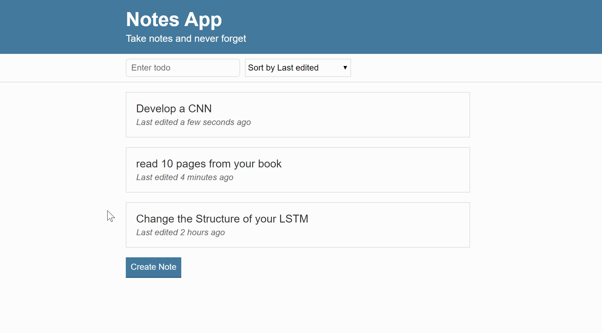

# Note App in JavaScript

This is an Interactive app, built from scratch in JavaScript - Originally developed 15/01/2020

# [Responsive Website Click](https://notes-app-m.netlify.app/)

## What was developed in this project
The goal of this project was to understand better User Interfaces and build a really robust website that people can use easily 
1. Build the backend for the creation of Notes.
2. Backend for the storage and sorting of the notes.
3. Combine the two pages and make a seamless experience.
4. Improve the UI using CSS.

## Results of the Project 

Create a New Note

Select one of the Notes

Short the Notes

## Technology Used 
- JavaScript
- CSS
- HTML
